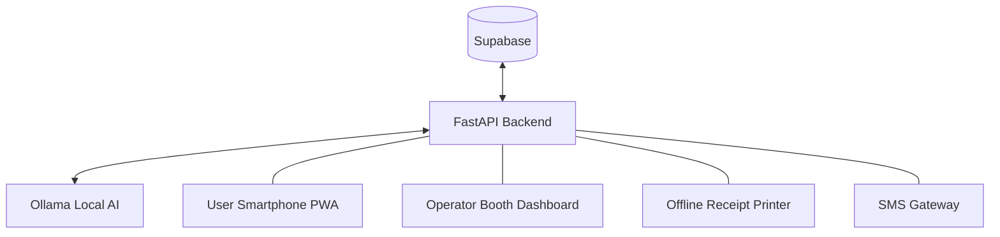

# Opportunity OS — Implementation Gaps & Strategy

This document outlines how we address the specific needs of rural/semi-urban users, improve retention, and ensure the system scales effectively.

## 1. Data Sources: Where does the data come from?

### Current (Hackathon Phase)
- **Seed Data**: 10+ realistic local opportunities (schemes, jobs, health camps) seeded via `seed_data.py`.
- **Operator Ingestion**: The primary "live" source. Booth operators/Panchayat staff paste raw text (circulars, WhatsApp messages, news clips) into the dashboard.
- **AI Structuring**: `ai.py` uses Ollama to extract title, eligibility, and simplified descriptions (English + Tamil).

### Future Roadmap
- **Official Scrapers**: Automate extraction from `myscheme.gov.in`, `tn.gov.in`, and specific district portals.
- **Citizen Journalists**: Trusted local volunteers can submit "verified" local alerts (e.g., "Seed distribution starting at Block Office").
- **Private Sector**: Local MSMEs can post daily-wage jobs via a simplified SMS-to-Job interface.

---

## 2. Pincode Intelligence (Zero-Cost & Local)

### How it works without API Keys
Indian PIN codes are **hierarchical**:
- **First 2 digits**: Identify the State/Union Territory.
- **First 4 digits**: Identify the District/Sub-region.
- **Full 6 digits**: Identify the specific Post Office/Village group.

**Matching Logic (`backend/pincode.py`):**
1. **Exact (Score 100)**: `user.pincode == opp.pincode`
2. **Sub-region (Score 50)**: `user.pincode[:4] == opp.pincode[:4]` (Nearby village/block)
3. **Regional (Score 10)**: `user.pincode[:2] == opp.pincode[:2]` (Same state)

This allows the matching engine to work **instantly and locally** without calling Google Maps or any paid Geocoding API.

---

## 3. Daily Utility & Retention (The "Village OS" Concept)

To prevent users from deleting the app after one-time use, we are adding **Daily Lifeline** features:

- **Town Alerts (`town_info`)**: Information that usually reaches villages late.
    - Bus/Train delays from the nearest town.
    - Government officer visit schedules (e.g., "The VAO will be in the village tomorrow at 10 AM").
    - Market price fluctuations (Mandi rates).
- **Daily Advisory (`advisory`)**: 
    - Weather alerts for farmers.
    - Health reminders (Vaccination drives, heatwave warnings).
- **Community Board**: 
    - Local news (Village festival dates, water supply timings).

---

## 4. AI-Powered Translations

The backend now uses **Ollama (Llama 3)** to generate dual-language output during ingestion:
1. **Simplified English**: For formal tracking and multi-state compatibility.
2. **Tamil (or Local Lang)**: For the user-facing Smartphone Feed, SMS alerts, and Print Receipts.

**Implementation**: Updated `ai.py` prompt to return `tamil_desc` alongside `simplified_desc`.

---

## 5. Scalability Architecture

### Multi-Frontend / Single-Backend
The system is designed for high horizontal scalability:

- **Efficiency**: Matching happens in pure Python/SQL; no costly per-user AI calls.
- **Deployment**: Backend can be deployed on a single VPS or Cloud Run; Supabase handles the database scaling automatically.
- **Offline-First**: PWA allows users to view cached "matches" even without a stable internet connection.

---

## 6. Demo Script Polish
- **Story**: "Meet Selvi, a daily-wage worker. She doesn't know she's eligible for a Tailoring course just 2km away. The operator pastes a WhatsApp message, AI structures it, and Selvi gets an SMS in Tamil. She walks in, gets a printed receipt, and applies."
- **Focus**: Accessibility (Tamil + Large UI) and O-Rank (Local relevance).
